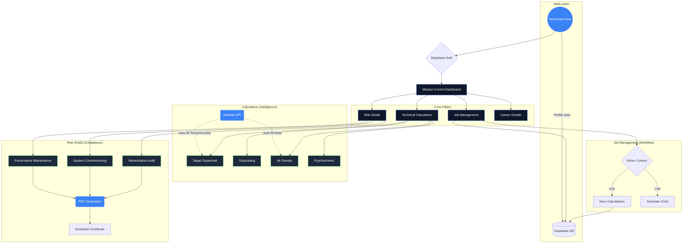

# HVAC-R Project Infographic Schematic

Since the visual generation service is currently at capacity, here is a structural schematic of the project's architecture and feature set, designed to be visualized as a system map.

## Key Features
- **Smart Integration**: Weather data automatically feeds into complex calculations.
- **Context Awareness**: "Active Job" state allows seamless hopping between tools while keeping data tied to the specific client/project.
- **Instant Compliance**: One-click generation of professional PDF certificates for various service scenarios.
