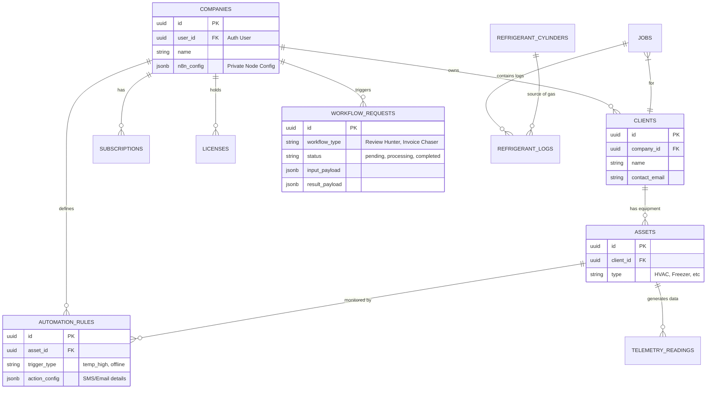

# 🤖 AI Agent Onboarding Context

**File Path:** `./AI_ONBOARDING.md`
**Usage:** Read this file FIRST to understand the ThermoNeural project context, architecture, and rules.

---

## 1. Project Mission 🚀
**ThermoNeural** is a "Business in a Box" platform for HVAC professionals. It combines:
1.  **SaaS App**: A React/Supabase web app for Estimations, CRM, and Project Management.
2.  **Heavy Compute Engine**: A dedicated Python/Go microservice for complex thermodynamic calculations (Render).
3.  **Member Automation Node**: A *private* n8n server provisioned on Vultr for every paying user (The "Digital Landlord" model).

## 2. Architecture Pillars (The "Holy Trinity") 🏛️

| Component | Tech Stack | Hosted On | Purpose | Critical Rule |
| :--- | :--- | :--- | :--- | :--- |
| **Client** | React, Vite, Tailwind | Netlify | UI/UX, Dashboards | **NO DOCKER**. PWA Only. |
| **Server** | Node.js, Express | Netlify (Functions) | API Proxy, Webhooks | Stateless. |
| **Database** | PostgreSQL | Supabase | Auth, Data | **Use Supabase CLI**. |
| **Math Engine** | Python/Go | **Render** | Thermodynamics, Energy Models | **External Repo** (`thermoneural-calc`). Accessed via API only. |
| **Member Node**| Docker, n8n | **Vultr** | User Automation, Workflows | **Isolated**. Not connected to Main DB. |

## 3. Directory Map 🗺️

-   **`/client`**: The React Frontend. `npm run dev` starts this.
-   **`/server`**: The Express Backend. Auto-started by `npm run dev`.
-   **`/skills`**: **The Knowledge Base**.
    -   `01_strategy`: Business goals.
    -   `03_development`: Technical validation.
    -   `04_infrastructure`: Scripts for **Vultr** (Member Nodes).
-   **`/supabase`**: Migrations and Edge Functions.
-   **`/scripts`**: Helper scripts (e.g., Render Service Discovery).

## 4. Operational Rules ⚠️

1.  **Docker Ban**: Do **NOT** use Docker or `supabase start` for the Main Application.
2.  **Cloud-Direct DB**: Always use `supabase db push` to apply migrations to the live project (`rxqflxmzsqhqrzffcsej`). Local DB simulation is deprecated.
3.  **Render for Math**: If `numpy` or `scipy` is needed, it goes to the **Render Service**, not the Node.js backend.
4.  **Vultr for n8n**: The `install.sh` in `skills/04_infrastructure` is for provisioning *remote* servers, not local dev.

## 5. Development Setup 🛠️

1.  **Install**: `npm install`
2.  **Env**: `cp .env.example .env` (See `.env.example` for required keys).
3.  **Start**: `npm run dev` (Runs Client :8080 and Server :3001).

## 6. Key Configuration Keys 🔑
-   `VITE_SUPABASE_URL`: Supabase Endpoint.
-   `VITE_CALCULATION_SERVICE_URL`: URL for the Render Math Engine.
-   `RENDER_API_KEY`: (Server-side) For managing Render services.
-   `VULTR_API_KEY`: (Server-side/n8n) For provisioning Member Nodes.

## 7. Agent & Subagent Protocols 🤖
**Strict Rules for AI Agents (Antigravity) usage of tools:**

### 7.1. Browsing Subagent Standards
1.  **Headless-First**: The subagent must operate in a headless-first manner unless visual debugging is explicitly requested by the user.
2.  **Single Tab Policy**: The subagent must ALWAYS use a **single tab** and navigate through it. Do not spawn multiple tabs unless explicitly instructed for a specific parallel test.
3.  **Authentication**: Use the following credentials when testing the app login flows:

| Role | Email | Password |
| :--- | :--- | :--- |
| **Admin** | `admin@admin.com` | `ThermoAdmin$2026!` |
| **Technician** | `tech@test.com` | `Password123!` |
| **Client** | `client@test.com` | `Password123!` |

*Note: If these fail, check `supabase/seed.sql` or the User Management dashboard.*

### 7.2. Headless Testing Protocol
1.  **Strict Headless**: All automated E2E tests must be run in **Headless Mode** (`headless: true`) as configured in `playwright.config.ts`.
2.  **Trace-Driven Analysis**: In the event of a failure, agents must use **Playwright Traces** and **Screenshots** to analyze the visual state and report findings.
3.  **Performant Assertions**: Avoid `waitForTimeout`. Use web-first assertions like `expect().toBeVisible()` to allow the headless runner to maximum throughput.
4.  **Hardware Acceleration**: Ensure launch options include `--enable-gpu` to match the rendering fidelity of headed browsers.

### 7.3. Performance Tools (Agent-Only)
Use these tools to skip long manual debugging turns:
1.  **System Health**: Run `npx tsx scripts/agent-doctor.ts` to verify environment and DB status before starting work.
2.  **State Diagnostics**: Run `npx tsx scripts/explore-context.ts <email>` to see the exact DB state for a specific user.
3.  **Math Consistency**: Use `@client/lib/formula-oracle.ts` for all HVAC calculations. Avoid ad-hoc math logic.

---
*End of Context*

## 8. Database Schema Map 🗄️

The following diagram illustrates the core entity relationships in Supabase.

