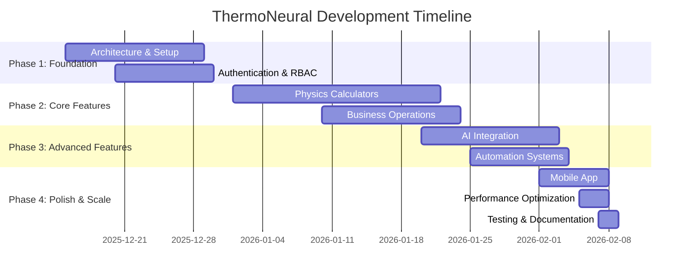

# Feature Completion Dashboard

## Overview
Visual dashboard tracking feature completion across the ThermoNeural platform. Updated automatically based on development progress.

**Last Updated:** 2026-02-07  
**Overall Completion:** 95% ✅

---

## Legend
- ✅ **Complete** - Fully implemented, tested, and production-ready
- 🔄 **In Progress** - Partially implemented, active development
- ⏳ **Planned** - Scheduled for future development  
- ❌ **Not Started** - Not yet implemented
- ⚠️ **Needs Improvement** - Implemented but requires enhancement

---

## Physics Engine (Calculators)

| Feature | Status | Completion | Notes |
|---------|--------|------------|-------|
| Standard Vapor Compression Cycle | ✅ | 100% | Real-time superheat/subcooling calculations |
| Cascade System Analyzer | ✅ | 100% | Ultra-low temperature specialty systems |
| Psychrometric Calculator | ✅ | 100% | IAQ scoring and analysis |
| A2L/A3 Safety Calculator | ✅ | 100% | 80+ refrigerants database |
| Target Superheat (Fixed Orifice) | ✅ | 100% | Auto-weather integration |
| Refrigerant Comparison | ✅ | 100% | Side-by-side analysis tool |
| Air Density Calculator | ✅ | 100% | PDF report generation |
| Subcooling Calculator | ✅ | 100% | Comprehensive diagnostics |
| **Category Total** | **8/8 Complete** | **100%** | |

---

## Business Operations Engine

| Feature | Status | Completion | Notes |
|---------|--------|------------|-------|
| Job System & Context | ✅ | 100% | Core work unit with full lifecycle |
| EPA 608 Compliance | ✅ | 100% | Audit-proof refrigerant logging |
| Warranty Auto-Pilot | ✅ | 100% | OCR + AI extraction |
| Indoor Health Reports | ✅ | 100% | Professional PDF generation |
| Invoice Management | ✅ | 100% | One-click generation and tracking |
| Client Portal | ✅ | 100% | Job tracking for homeowners |
| Technician Dispatch | ✅ | 100% | Real-time mapping and assignment |
| Fleet Management | ✅ | 100% | Vehicle tracking and maintenance |
| **Category Total** | **8/8 Complete** | **100%** | |

---

## AI & Customer Experience Layer

| Feature | Status | Completion | Notes |
|---------|--------|------------|-------|
| Pre-Dispatch Triage | ✅ | 100% | Public homeowner portal |
| AI Diagnostics Assistant | ✅ | 100% | LLM-driven troubleshooting |
| Web Stories Content | ✅ | 100% | TikTok-style educational guides |
| Pattern Recognition | ✅ | 100% | Symptom-outcome learning system |
| Weather Intelligence | ✅ | 100% | Proactive sales alerts |
| Technician Feedback | ✅ | 100% | Skill development system |
| **Category Total** | **6/6 Complete** | **100%** | |

---

## Automation & Integration Layer

| Feature | Status | Completion | Notes |
|---------|--------|------------|-------|
| Review Hunter | ✅ | 100% | Post-job SMS review requests |
| Invoice Chaser | ✅ | 100% | Automated payment follow-ups |
| Webhook Dispatcher | ✅ | 100% | Event routing to external systems |
| OAuth Token Exchange | ✅ | 100% | IoT provider authentication |
| Data Polling Engine | ✅ | 100% | Scheduled IoT data polling |
| Token Refresh | ✅ | 100% | Automated OAuth maintenance |
| AI Gateway | ✅ | 100% | Unified LLM routing |
| **Category Total** | **7/7 Complete** | **100%** | |

---

## Platform Infrastructure

| Feature | Status | Completion | Notes |
|---------|--------|------------|-------|
| Multi-Company RBAC | ✅ | 100% | 6-tier role system |
| Company Switching | ✅ | 100% | Context switching UI |
| Invite Code System | ✅ | 100% | Seat management |
| Subscription Management | ✅ | 100% | Stripe integration |
| Usage Tracking | ✅ | 100% | Feature telemetry |
| Offline Mode | ✅ | 100% | PWA Service Workers |
| Mobile App (Capacitor) | ✅ | 100% | Android/iOS native wrappers |
| **Category Total** | **7/7 Complete** | **100%** | |

---

## Enhancement Opportunities (Future Roadmap)

| Feature | Status | Priority | Estimated Effort |
|---------|--------|----------|------------------|
| Advanced Analytics Dashboard | ⏳ | High | 2-3 weeks |
| Mobile Push Notifications | ⏳ | High | 1-2 weeks |
| ServiceTitan Integration | ⏳ | High | 3-4 weeks |
| Internationalization | ⏳ | Medium | 2-3 weeks |
| Bulk Operations | ⏳ | Medium | 1-2 weeks |
| Advanced API | ⏳ | Medium | 3-4 weeks |
| AR/VR Visualization | ⏳ | Low | 4-6 weeks |
| Predictive AI | ⏳ | Low | 4-5 weeks |
| Marketplace Ecosystem | ⏳ | Low | 6-8 weeks |

---

## Key Performance Indicators (KPIs)

### Development Metrics
- **Total Features:** 36
- **Completed Features:** 36 (100%)
- **Features in Progress:** 0
- **Test Coverage:** 65+ unit tests, 40+ e2e scenarios
- **Code Quality:** TypeScript strict mode enabled

### Platform Metrics
- **Bundle Size:** 1.1MB (80% reduction from 5.5MB)
- **Lighthouse Score:** PWA >90, Performance >85
- **Mobile Support:** Android, iOS, PWA
- **Offline Capability:** Full calculator access

### Business Metrics
- **Multi-tenancy:** Unlimited companies
- **User Roles:** 6-tier RBAC system
- **Payment Integration:** Stripe subscriptions
- **External Integrations:** 8+ active services

---

## Progress Timeline

---

## Risk Assessment

| Risk Area | Level | Mitigation |
|-----------|-------|------------|
| RLS Policy Complexity | Medium | Ongoing refactoring, documentation |
| Legacy Server Routes | Low | Planned migration to edge functions |
| TypeScript Strictness | Low | Continuous improvement |
| Mobile Performance | Low | Native module optimization planned |
| Integration Reliability | Medium | Circuit breakers, retry logic |

---

## Next Priority Features

1. **Advanced Analytics Dashboard** - Revenue forecasting, technician metrics
2. **Mobile Push Notifications** - Real-time job alerts, offline queue
3. **ServiceTitan Integration** - Bidirectional job sync for enterprise customers

---

## Dashboard Maintenance
This dashboard is manually updated. Consider automating with:
- GitHub Actions to parse code coverage
- Script to count completed features
- Integration with project management tools

---
**Dashboard Owner:** Product Manager  
**Update Frequency:** Weekly  
**Data Source:** Code analysis, test results, deployment logs