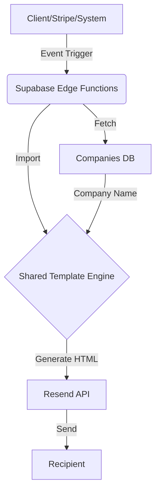

# Unified White-Label Notification System 📧💬

This document details the architecture of the ThermoNeural Notification Automation System. The system is designed to provide **transactional email and SMS reliability** with **premium, white-label branding** for our subscribers.

## 1. Architecture Overview

The system uses a **Centralized Webhook Dispatcher** pattern running on Supabase Edge Functions. It leverages **Resend** as the email delivery provider.

## 2. Key Components

### A. Shared Template Engine (`supabase/functions/_shared/email-template.ts`)

A single TypeScript module responsible for generating ALL email HTML. ensuring brand consistency.

* **Features:**
  * **Dynamic Branding:** Accepts `companyName` to customize the header.
  * **Platform Attribution:** Automatically adds "Powered by Thermoneural" in the footer.
  * **Dark Mode Support:** Forces correct button colors (`#2563eb`) even in Outlook dark mode.
  * **Responsive:** Mobile-optimized layout.

### B. Functions

1. **`webhook-dispatcher`**:
    * **Purpose:** Handles internal app events.
    * **Triggers:** `client_invite`, `system_alert`, `job_scheduled`.
    * **Logic:** Fetches company white-labeling and client preferences. Supports `force_send` flag to bypass client opt-outs.

2. **`review-hunter`**:
    * **Purpose:** Automates review collection.
    * **Logic:** Triggered when a job is completed. Respects client-level SMS/Email preferences unless overridden by `force_send`.

3. **`stripe-webhook`**:
    * **Purpose:** Transactional billing emails.
    * **Branding:** Sent from "Thermoneural" (Platform Brand).

4. **`invoice-chaser`**:
    * **Purpose:** Recover revenue from overdue invoices.
    * **Logic:** Scheduled nightly check. Sends reminders to clients with unpaid invoices past due date.

---

## 3. Admin Overrides & Manual Actions

The system provides a specialized UI within the **Client Detail** page for administrators to manually trigger notifications.

* **Bypass Preferences**: A master toggle that sets `force_send: true` in the workflow request.
* **Manual Triggers**:
  * **Send Portal Link**: Sends a manual `client_invite` with a magic login link.
  * **Send Review Request**: Manually triggers the `review-hunter` workflow.

---

## 4. Environment Variables

... (unchanged) ...

---

## 5. SMS Integration (Telnyx)

... (unchanged) ...

**Workflows Using SMS:**
* `client_invite` - Portal invitations with login links (Manual or Automated)
* `system_alert` - Temperature/equipment alerts (Automated)
* `job_scheduled` - Appointment confirmations (Automated)
* `review_request` - Post-job review requests (Manual or Automated)
